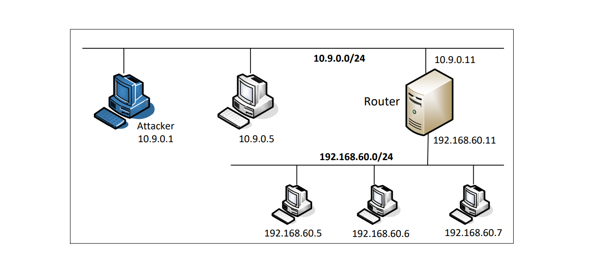

# Lab 7: Firewall Exploration Lab

>Copyright © 2006 - 2021 by Wenliang Du.
>This work is licensed under a Creative Commons Attribution-NonCommercial-ShareAlike 4.0 International License. If you remix, transform, or build upon the material, this copyright notice must be left intact, or reproduced in a way that is reasonable to the medium in which the work is being re-published.

## 1. Overview
Linux has a built-in firewall called `iptables`. In this lab, students will be given a simple network topology, and are asked to use `iptables` to set up firewall rules to protect the network. Students will also be exposed to several other interesting applications of `iptables`. This lab covers the following topics:

- Using `iptables` to set up firewall rules
- Various applications of `iptables`

## 2. Lab Environment

### Step 1: Download and Extract the Lab Files
Download `Labsetup.zip` from the lab’s website and unzip it. This will provide you with the necessary files, including the `docker-compose.yml` for setting up the lab environment.

```
# Download the lab setup files
sudo wget https://seedsecuritylabs.org/Labs_20.04/Files/Firewall/Labsetup.zip

# Unzip the lab setup files
sudo unzip Labsetup.zip
```

### Step 2: Navigate to the Lab Setup Directory
Move into the extracted Labsetup folder, where you will find the `docker-compose.yml` file and other necessary files.

```
# Enter the Labsetup folder
cd Labsetup
ls
```

Figure 1 shows the lab setup.


&emsp; &emsp; &emsp; &emsp; &emsp; &emsp; &emsp; &emsp; &emsp; &emsp; &emsp; Figure 1: Firewall Lab setup.

<Br>
&emsp; 
The network topology can be described as the following:

* Router:
   - External interface: eth0 (10.9.0.11/24) connected to the external network (10.9.0.0/24).
   - Internal interface: eth1 (192.168.60.11/24) connected to the internal network (192.168.60.0/24).
* Hosts:
   - Attacker: 10.9.0.1 (external network).
   - External host: 10.9.0.5 (external network).
   - Internal hosts:
     Host 1: 192.168.60.5.
     Host 2: 192.168.60.6.
     Host 3: 192.168.60.7.


### Step 3: Build the Docker Container
Use Docker Compose to build the container image. This step prepares the environment for running your web server with the required configurations.

```
# Build the Docker container
docker-compose build
```
```
# OR use the alias
dcbuild
```

### Step 4: Start the Docker Container
This command initializes and runs the container based on the configurations specified in the `docker-compose.yml` file.

```
# Start the Docker container
docker-compose up -d
```
```
# OR use the alias
dcup -d
```

#### Stopping and Shutting Down the Docker Container
When you’re finished or need to reset the environment, you should shut down the running container to release resources.
Don't do this now, as you need the Docker container up for this lab.

```
# Stop and shut down the Docker container
docker-compose down
```
```
# OR use the alias
dcdown
```

### Step 5: Run Commands on the Docker Container
All the containers will be running in the background. To run commands on a container, we often need
to get a shell on that container. We first need to use the `docker ps` command to find out the ID of
the container, and then use `docker exec` to start a shell on that container. We have created aliases for
them in the `.bashrc` file.

#### 1. List Running Docker Containers
Use the alias `dockps` to view a list of running containers, displaying each container's ID and name in a simplified format.

```
dockps
```

#### Output
The output will list all running Docker containers, each with its unique ID and assigned name. An example output might look like this:

```
b1004832e275 hostA-10.9.0.5
0af4ea7a3e2e hostB-10.9.0.6
9652715c8e0a hostC-10.9.0.7
```
Each line includes the container ID and its corresponding name (in this case, hostA, hostB, and hostC), along with their assigned IP addresses.

#### 2. Access a Specific Container’s Shell
To open a shell inside a specific container, use the alias `docksh` followed by the first few characters of the container's ID. For example, to access hostC-10.9.0.7, use the ID prefix 96 (from the third line in the previous output).

```
docksh 96
```

#### Output
You will be logged into a shell session inside the specified container. The prompt will change to show the container ID, indicating that you are now inside the container:

```
root@9652715c8e0a:/#
```

#### Note: If a Docker command requires the container ID, you only need to type the first few characters, as long as they are unique among all running containers.

### Lab Environment Setup Complete

Your lab environment setup is now complete, and you're ready to begin your lab! Navigate to the next page to get started.
